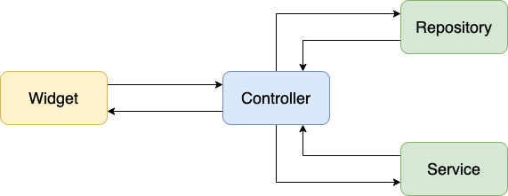

# Musicians Shop

### Platforms
```
1 - Android, min version 6.0 (API level 23)
2 - iOS, target version 15.2
3 - Web
```

### Architecture
Project using GetX for communication between layers

## Getting Started



### Libraries & Tools

- [Flutter Channel stable, 2.10.5](https://flutter.dev/)

Core
- [get](https://github.com/jonataslaw/getx)

UI
- [cupertino_icons](https://github.com/flutter/packages/tree/master/third_party/packages/cupertino_icons)

Dev Dependencies
- [flutter_lints](https://github.com/flutter/packages/tree/main/packages/flutter_lints)
- [flutter_launcher_icons_maker](https://github.com/gsmlg-dev/flutter_launcher_icons_maker)

Utils
- [url_launcher](https://github.com/flutter/plugins/tree/main/packages/url_launcher/url_launcher)
- [package_info_plus](https://github.com/fluttercommunity/plus_plugins/tree/main/packages)

### Directory Structure
Here is the core folder structure which flutter provides.

```
flutter-app/
|- android
|- build
|- ios
|- lib
|- test
|- web
|- windows
```

Here is the folder structure we have been using in this project

```
lib/
|- data/
|- domain/
|- presentation/
|- shared/
|- main.dart
```

Now, lets dive into the lib folder which has the main code for the application.

```
1- data - Contains the data layer of project, includes directories for local, network and shared pref/cache.
2- domain - Contains abstraction and business logic of project, includes models, responses, request, etc.
3- presentation - Contains all the ui of project, contains sub directory for each screen.
4- shared - Contains the utilities/common functions, styles of application.
5- main.dart - This is the starting point of the application. All the application level configurations are defined in this file i.e, theme, routes, title, orientation etc.
```

### Main
This is the starting point of the application. All the application level configurations are defined in this file i.e, theme, routes, title, orientation etc.

```dart
import 'package:flutter/material.dart';
import 'package:get/get.dart';
import 'package:musicians_shop/presentation/bindings/global_binding.dart';
import 'package:musicians_shop/presentation/router/router.dart';
import 'package:musicians_shop/presentation/router/routes.dart';
import 'package:musicians_shop/shared/core/localization/keys.dart';
import 'package:musicians_shop/shared/core/localization/translations.dart';
import 'package:musicians_shop/shared/styles/themes.dart';
import 'package:musicians_shop/shared/utils/utils.dart';

void main() async {
  WidgetsFlutterBinding.ensureInitialized();
  runApp(const App());
}

class App extends StatelessWidget {
  const App({Key? key}) : super(key: key);

  @override
  Widget build(BuildContext context) {
    return GetMaterialApp(
      navigatorKey: Get.key,
      getPages: AppRouter.routes,
      initialRoute: AppRoutes.splash,
      title: StringsKeys.musicianShop.tr,
      initialBinding: GlobalBinding(),
      translations: Translation(),
      locale: Locale(getLangCode()),
      theme: AppThemes.dark,
      debugShowCheckedModeBanner: false,
    );
  }
}
```